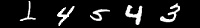
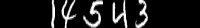

# **Description**
This package aims to create various training datasets for OCR model, which randomly extract single digit images from the MNIST dataset
and stitch them into a qualified sample representing a given number. To increase the sample variety and the robustness of OCR model,
we use the common image processing operations such as inflation, corruption, rotation and salt-and-pepper noise to enlarge the sample size.
This package can automatically download the MNIST dataset and divide it into 10 groups according to the labels. Besides, this package also
supports batch processing and the generated images will be neatly outputted into a given directory.
This package is available on my [github](https://github.com/luobao-intel/digit_sequence) .
## **Requirement**
This code is tested on:
- Python          3.5.4
- matplotlib      3.0.3
- numpy           1.17.0
- opencv-python   4.1.0.25
- Pillow          6.1.0
- six             1.12.0

## **Usage**
```
usage: run.py [-h] [-d DATA_DIR] [-s IMAGE_DIR] [-n NUMBER] [-w IMAGE_WIDTH]
              [-ht IMAGE_HEIGHT] [-min MIN_SPACING] [-max MAX_SPACING] [-c]
              [-a] [-b] [-m MARGIN] [-r ROTATE] [-bn BATCH_NUM]

    python create_digit_sequence.py --number=14543 --image_width 200 --image_height 28      --min_spacing=5 --max_spacing=10      --need_crop=True --batch=True --batch_num=100      --need_aug=True --margin 4 --rotate 30


optional arguments:
  -h, --help            show this help message and exit
  -d DATA_DIR, --data_dir DATA_DIR
                        dir to save the MNIST dataset
  -s IMAGE_DIR, --image_dir IMAGE_DIR
                        dir to save the produced images
  -n NUMBER, --number NUMBER
                        A string representing the number
  -w IMAGE_WIDTH, --image_width IMAGE_WIDTH
                        The image width
  -ht IMAGE_HEIGHT, --image_height IMAGE_HEIGHT
                        the image height
  -min MIN_SPACING, --min_spacing MIN_SPACING
                        The minimum spacing between digits
  -max MAX_SPACING, --max_spacing MAX_SPACING
                        The maximum spacing between digits
  -c, --need_crop       Cut out the redundant border
  -a, --need_aug        need data augmentation
  -b, --need_batch      need different digit sequences with same number input
  -m MARGIN, --margin MARGIN
                        The padding width
  -r ROTATE, --rotate ROTATE
                        max rotate degree 0-45
  -bn BATCH_NUM, --batch_num BATCH_NUM
                        the batch number if need different digit sequences
```

## **Function**

- Normal function
   - Just simply build images representing a given number with parameters setting:
```
python3 run.py -n 14543 -w 200 -min 5 -max 10 
```

- Invalid width
   - If the image width can't satisfy the random space between digits as follows,
   the image could be automatically resized into the given width.
```
python3 run.py -n 14543 -w 160 -min 5 -max 10 
```


- Crop function
  - Note that the space is not fully occupied by digit in an original single picture.
  We can use -c is set to cut the redundant space.
```
python3 run.py -n 14543 -w 200 -min 5 -max 10 -c
```

- Data Augmentation
  - The most important purpose of this package is to create various training samples for OCR model.
  The image processing skills such as dilating, eroding, adding pepper noise, warping and rotating can increase the diversity of samples to improve the performance of OCR model.
  We can also set the parameters such as the angle of rotation by using -r and the kernels inside the package.
```
python3 run.py -n 14543 -w 200 -min 5 -max 10 -c -a 

```


- Batch processing
  - Generating a single image could be ineffective and batch processing can greatly improve the efficiency.
  Here, each input number corresponds to a folder in image_dir with batch-generated images inside.
  we can use -s to set the save path, -b to open batch generation function and -bn to set the numbers of images we want.
```
python3 run.py -n 14543 -w 200 -min 5 -max 10 -c -a -b -bn=100

```
